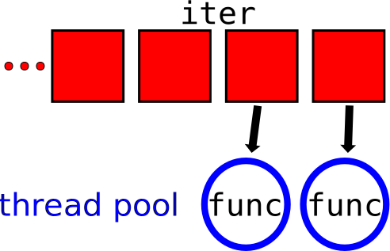
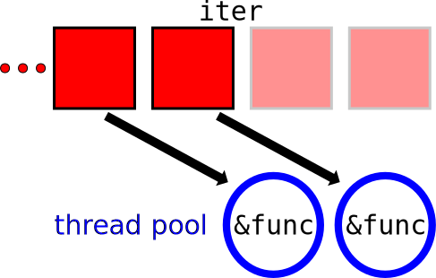
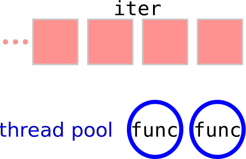
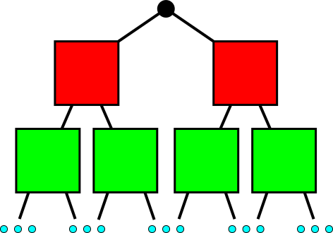

% simple_parallel

Huon Wilson

[@huon_w](https://twitter.com/huon_w)


[huonw.github.io/simple_parallel-jan16](http://huonw.github.io/simple_parallel-jan16)

# Slooow, Simple: `for`

```rust
extern crate image;
use std::path::Path;

fn resize_image(path: &Path) -> image::ImageResult<()> {
    // load the file as an image
    let img = try!(image::open(path));

    // resize it
    let smaller = img.resize(400, 400, image::Lanczos3);

    // and save it with the same name in /tmp
    let output = Path::new("/tmp/").join(path.file_name().unwrap());
    let mut f = try!(File::create(output));
    smaller.save(&mut f, image::JPEG)
}

fn main() {
    // command line arguments
    let files = env::args().skip(1);

    for s in files {
        match resize_image(s.as_ref()) {
            Ok(_) => {}
            Err(e) => println!("{}: error {:?}", s, e)
        }
    }
}
```

# Slooow, Simple: `for`

```rust


let files = env::args().skip(1);

for s in files {
    match resize_image(s.as_ref()) {
        Ok(_) => {}
        Err(e) => println!("{}: error {:?}", s, e)
    }
}
```

# Fast, Complicated: threading

```rust
extern crate scoped_threadpool;

let files = env::args().skip(1);

// set up the threads
let mut pool = scoped_threadpool::Pool::new(4);
pool.scoped(|scope| {
    // run over the images
    for s in files {
        // spawning a job for each one
        scope.execute(move || {
            match resize_image(s.as_ref()) {
                Ok(_) => {}
                Err(e) => println!("{}: error {:?}", s, e)
            }
        })
    }
});
```


# Fast, Simple: *magic* threading

```rust
extern crate simple_parallel;

let files = env::args().skip(1);

simple_parallel::for_(files, |s| {
    match resize_image(s.as_ref()) {
        Ok(_) => {}
        Err(e) => println!("{}: error {:?}", s, e)
    }
})
```

# How does it work?

```rust
pub fn for_<I, F>(iter: I, func: F)
    where I: IntoIterator, // yields...
          I::Item: Send, // which are passed to...
          F: Fn(I::Item) + Sync
```

<hr class="pause">



# How does it work?

```rust
pub fn for_<I, F>(iter: I, func: F)
    where I: IntoIterator, // yields...
          I::Item: Send, // which are passed to...
          F: Fn(I::Item) + Sync
```



# How does it work?

```rust
pub fn for_<I, F>(iter: I, func: F)
    where I: IntoIterator, // yields...
          I::Item: Send, // which are passed to...
          F: Fn(I::Item) + Sync
```



# Sharing

Safe:

```rust
let mut data = [0, 1, 2, 3, 4, 5, 6, 7, 8, 9];
let outside = 1;

simple_parallel::for_(&mut data, |elem| *elem += outside);
```

<hr class="pause"></hr>

Unsafe:

```rust
let mut data = [0, 1, 2, 3, 4, 5, 6, 7, 8, 9];
let mut outside = 1;

simple_parallel::for_(&mut data, |elem| outside += *elem);
```

<hr class="pause"></hr>

```error
error: cannot assign to data in a captured outer variable in an `Fn` closure
     simple_parallel::for_(&mut data, |elem| outside += *elem);
                                             ^~~~~~~~~~~~~~~~

```

# Fast?


<center>

|   |   |
|---|---|
| `for ... in` | **40** seconds |
| `simple_parallel::for_` | **10** seconds |
|  | **4**&times; faster. |

</center>


# Iterators do more than `for`

```rust
let number_of_errors =
    files
        .map(|s| resize_image(s.as_ref()))
        .filter(|e| e.is_err())
        .count();

println!("{} errors occurred", number_of_errors);
```

# `simple_parallel` does too!

```rust
let number_of_errors = crossbeam::scope(|scope| {

    simple_parallel::map(scope,
            files,
            |s| resize_image(s.as_ref()))
        .filter(|e| e.is_err())
        .count()

});

println!("{} errors occurred", number_of_errors);
```

<span style="display:block;text-align:right">(`std::thread::scoped`-pocalyse: [#24292](https://github.com/rust-lang/rust/issues/24292))</span>

# Ordering?

Some jobs finish faster than others: `unordered_map`.

```rust
let number_of_errors = crossbeam::scope(|scope| {

    simple_parallel::unordered_map(scope,
            files,
            |s| resize_image(s.as_ref()))
        .filter(|e| e.1.is_err())
        .count()

});

println!("{} errors occurred", number_of_errors);
```

# &nbsp;


<div style="font-size: 0.7em; text-align: right">(with apologies)</div>

# The Ugly

The internals, especially around panics (need `std::panic::recover`)

`Iterator` is the only bound, so only action available is `next` and
sending elements over channels. Can be done more efficiently for some
types (e.g. `&[T]`, `&mut [T]`).

# The Bad

Inflexible: not designed for trees, divide-and-conquer (unlike rayon).



# The Good

Great for "flat", embarrassingly parallel work.


Simple, just:

- `s/for/simple_parallel::for_/`
- `s/map/simple_parallel::map/`

<small>(almost)</small>

<hr class="pause">

**More info: [huonw.github.io/simple_parallel-jan16](http://huonw.github.io/simple_parallel-jan16)**
